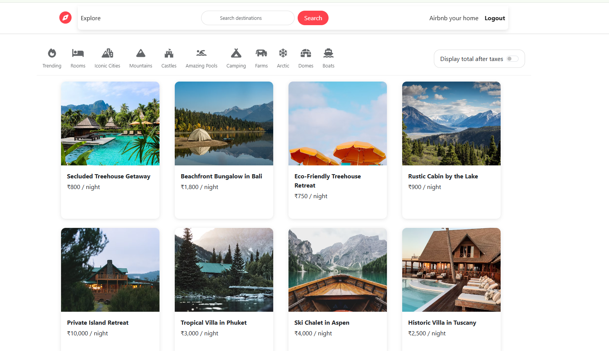
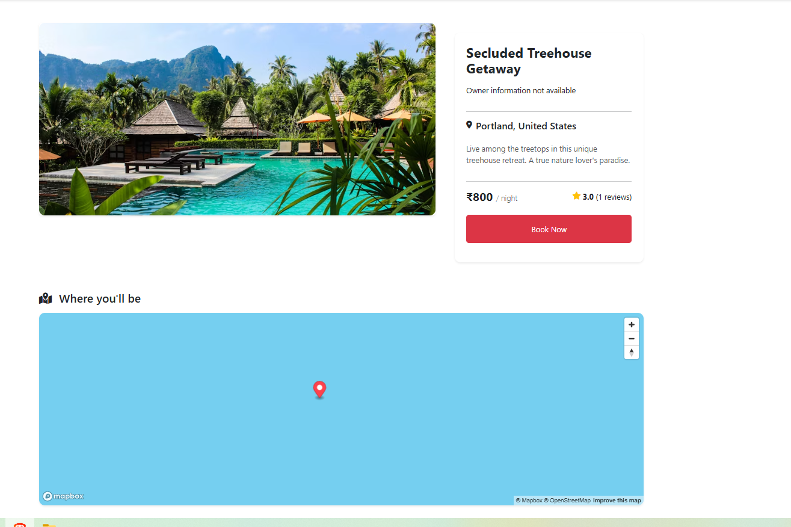

# 🌍 WonderLust – Airbnb Clone with Node.js

**WonderLust** is a full-stack web application inspired by Airbnb, where users can explore, list, review, and book unique stays around the world. Built with Node.js, Express, MongoDB, and EJS.

---

## ✨ Features

- 🔍 Search listings by keyword or location
- 🏠 Post your own stay (Airbnb your home!)
- 💬 Add and manage reviews
- 🧭 Interactive filtering
- 🗺️ Mapbox integration for location view
- 🔐 Authentication with login/signup
- ⚙️ Razorpay integration (coming soon!)

---

## 🛠 Tech Stack

| Tech       | Description                      |
|------------|----------------------------------|
| Node.js    | Server-side runtime              |
| Express.js | Backend framework                |
| MongoDB    | NoSQL database                   |
| Mongoose   | MongoDB object modeling          |
| EJS        | Templating engine                |
| Bootstrap  | Responsive UI styling            |
| FontAwesome| Icons                            |
| Mapbox     | Interactive maps                 |
| Razorpay   | (In progress) Payment integration|

---

📸 Screenshots

📄 License
This project is licensed under the MIT License.

🙋‍♂️ Author
Made with ❤️ by Rakesh Kushwaha
GitHub Profile https://github.com/rakeshkushwaha332

